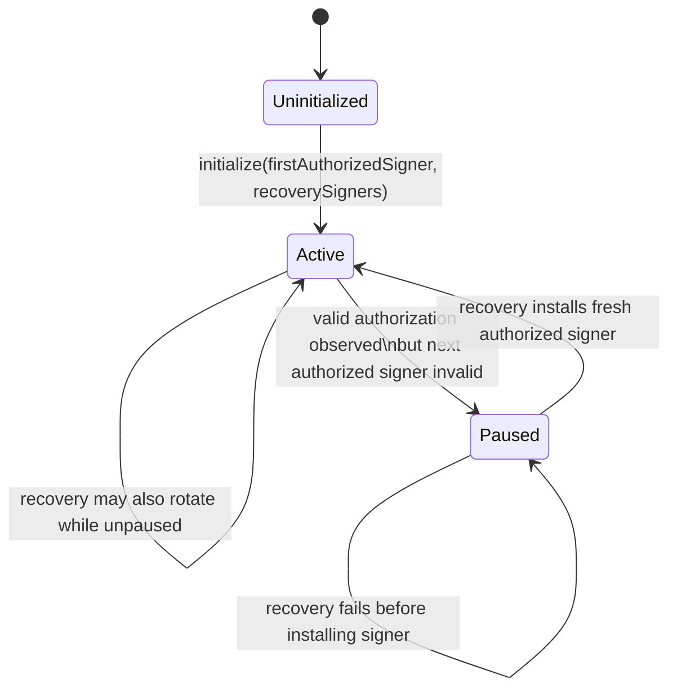
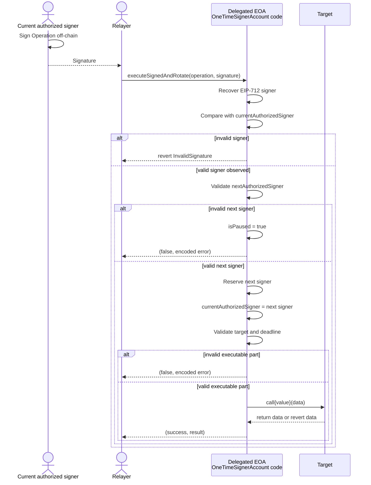

# OneTimeSignerAccount.sol

## Status

`src/OneTimeSignerAccount.sol` is an experimental EIP-7702 delegated-account prototype.

It is not audited, not production-ready, and must not be used with real assets. The contract is designed to study one-time ECDSA signer rotation under the project threat model described in [`docs/threat-model.md`](./threat-model.md).

The implementation assumes that once a valid ECDSA signature from a signer has been observed, the corresponding key must be treated as exposed. The on-chain design therefore tries to ensure that an observed signer cannot control the account again.

## Purpose

`OneTimeSignerAccount` is a minimal account implementation intended to be installed as delegated code for an EOA through EIP-7702.

Its core behavior is:

1. initialize a delegated EOA with a first one-time authorized signer;
2. accept signed operations from the current authorized signer;
3. rotate to a fresh authorized signer before external execution;
4. preserve rotation even if the target call fails;
5. pause the account when rotation cannot safely proceed;
6. allow recovery through one-time recovery signers.

The contract stores signer addresses, not raw keys. Each signer address is expected to correspond to a fresh off-chain ECDSA keypair.

## EIP-7702 execution context

This contract is not intended to be used directly as a normal deployed account. It is intended to be deployed once as an implementation and then executed through an EIP-7702 delegated EOA.

In that delegated execution context:

* `address(this)` is the delegated EOA address.
* `msg.sender` is the external caller of the delegated EOA, unless the EOA calls itself during setup.
* storage reads and writes are applied to the delegated EOA storage.
* ETH balance and outbound calls belong to the delegated EOA.
* external targets see the delegated EOA as `msg.sender`.

This is why an operation executed through `executeSignedAndRotate()` calls the target from the EOA address, not from the implementation contract address.

The implementation keeps an immutable `IMPLEMENTATION_ADDR = address(this)` set at deployment time. During delegated execution, `address(this)` differs from `IMPLEMENTATION_ADDR`; during direct calls to the implementation, they are equal.



## Storage model

All account state lives in the delegated EOA storage when the implementation is used correctly.

### `isInitialized`

Tracks whether the delegated EOA has already been initialized.

Initialization can only happen once. It sets:

* `isInitialized = true`;
* the delegated EOA address as consumed/reserved;
* the first authorized signer;
* the initial active recovery signers.

The initializer must be called through the delegated account, and `msg.sender` must equal `address(this)`. In practice, setup uses the delegated EOA itself as the caller after attaching the EIP-7702 delegation.

### `isPaused`

Blocks normal authorized-signer flows.

When `isPaused == true`:

* `executeSignedAndRotate()` reverts with `AccountIsPaused`;
* `rotateAuthorizedSigner()` reverts with `AccountIsPaused`;
* recovery functions remain available;
* the account can still receive ETH.

Paused mode is entered when a valid authorization has exposed the current key but the contract cannot rotate to a safe next authorized signer.

### `currentAuthorizedSigner`

The signer address currently allowed to authorize normal account operations.

For signed operations, the recovered EIP-712 signer must equal `currentAuthorizedSigner`.

For direct rotation, `msg.sender` must equal `currentAuthorizedSigner`.

### `isConsumedOrReservedSigner`

Conceptual role: `usedKey`.

Actual implementation name: `isConsumedOrReservedSigner`.

This mapping tracks signer addresses that must never become newly authorized again. It is stricter than a simple “used key” mapping because signers are marked as consumed/reserved when they are installed or registered, not only after they are later replaced.

The mapping is used for both normal authorized signers and recovery signers.

Reserved signers include:

* the delegated EOA address itself;
* the first authorized signer;
* every authorized signer installed through rotation;
* every initial recovery signer;
* every replacement recovery signer.

A signer in this mapping cannot be used as a future `nextAuthorizedSigner` or `nextRecoverySigner`.

### `isActiveRecoverySigner`

Conceptual role: `activeRecoverySigner`.

Actual implementation name: `isActiveRecoverySigner`.

This mapping tracks recovery signer addresses that are currently allowed to recover the account.

A recovery signer is one-time:

* it is registered as active during initialization or recovery rotation;
* it is already marked as consumed/reserved when registered;
* it is deactivated immediately when used for recovery;
* it cannot be registered again.

## Operations

`Operation` is the normal account operation type authorized by the current one-time signer.

```solidity
struct Operation {
    address target;
    uint256 value;
    bytes data;
    address nextAuthorizedSigner;
    uint256 deadline;
}
```

### Fields

| Field                  | Meaning                                                                |
| ---------------------- | ---------------------------------------------------------------------- |
| `target`               | Address called by the delegated EOA.                                   |
| `value`                | ETH value sent from the delegated EOA.                                 |
| `data`                 | Calldata sent to `target`.                                             |
| `nextAuthorizedSigner` | Fresh signer that should control the account after this operation.     |
| `deadline`             | Last timestamp at which the executable part of the operation is valid. |

### Signing

Operations are signed as EIP-712 typed data.

The Solidity type hash is:

```solidity
Operation(
    address target,
    uint256 value,
    bytes32 dataHash,
    address nextAuthorizedSigner,
    uint256 deadline
)
```

The signed message contains `keccak256(operation.data)`, not raw `bytes data`.

The signature must recover to `currentAuthorizedSigner` under `hashOperation(operation)`. Any address may submit the signed operation; the relayer is not trusted.

### Validation

`executeSignedAndRotate()` performs validation in two phases.

Before consuming the signer:

1. recover the EIP-712 signer;
2. require the recovered signer to equal `currentAuthorizedSigner`.

If the signer is invalid, the function reverts. The current authorized key is not consumed because the contract has not observed a valid authorization from that key.

After a valid signature is observed:

1. validate `operation.nextAuthorizedSigner`;
2. rotate to it, or pause if it is invalid;
3. validate the executable part of the operation;
4. call the target only if executable validation passes.

Executable validation checks:

* `target != address(0)`;
* `block.timestamp <= deadline`.

These checks intentionally happen after signer rotation. If the operation is expired or has an invalid target, the signer has still produced a valid signature, so the key must still be consumed.

### Signer rotation

Rotation is performed by `_rotateAuthorizedSignerOrPause()`.

A valid `nextAuthorizedSigner` must be:

* non-zero;
* not present in `isConsumedOrReservedSigner`.

On success:

1. the next signer is marked in `isConsumedOrReservedSigner`;
2. `currentAuthorizedSigner` is updated;
3. `AuthorizedSignerRotated` is emitted.

The previous signer is not separately marked during rotation because it was already marked as consumed/reserved when it became authorized.

If the next signer is invalid:

1. `isPaused` is set to `true`;
2. `AccountPaused` is emitted;
3. the function returns `(false, encodedError)`;
4. no target call is performed.

### External execution

After successful rotation and executable validation, the contract performs:

```solidity
operation.target.call{value: operation.value}(operation.data)
```

The target call result is returned to the caller.

The function does not revert only because the target reverted. Instead, it returns:

```solidity
(success, result)
```

This preserves the signer rotation. Reverting after rotation would roll back the storage update and would allow the exposed signer to remain valid.



## Recovery operations

Recovery can be performed in two ways:

1. direct recovery by an active recovery signer;
2. EIP-712 signed recovery submitted by any relayer.

Both paths consume the recovery signer before attempting to install replacement signers.

### Direct recovery

```solidity
rotateAuthorizedSignerThroughRecovery(
    address nextAuthorizedSigner,
    address nextRecoverySigner
)
```

This function must be called directly by an active recovery signer.

It:

1. checks `msg.sender` is active in `isActiveRecoverySigner`;
2. deactivates `msg.sender`;
3. emits `RecoverySignerConsumed`;
4. calls `_recoverAuthorizedSigner()`.

There is no deadline in this direct path because authorization comes from the transaction sender itself.

### Signed recovery

```solidity
struct RecoveryOperation {
    address nextAuthorizedSigner;
    address nextRecoverySigner;
    uint256 deadline;
}
```

`RecoveryOperation` is signed as EIP-712 typed data by an active recovery signer.

Any address may submit the signed recovery through:

```solidity
signedRecovery(RecoveryOperation calldata recoveryOperation, bytes calldata signature)
```

The function:

1. recovers the EIP-712 signer;
2. checks the signer is active in `isActiveRecoverySigner`;
3. deactivates the recovery signer immediately;
4. checks the deadline;
5. calls `_recoverAuthorizedSigner()`.

If the recovered signer is not active, the function reverts and no recovery signer is consumed.

If the signature is valid but the recovery operation is expired, the recovery signer is still consumed and the function returns `(false, encoded ExpiredOperation)`.

### Recovery validation

`_recoverAuthorizedSigner()` first validates `nextAuthorizedSigner`.

A valid `nextAuthorizedSigner` must be:

* non-zero;
* not already consumed or reserved.

If this validation fails:

* the recovery signer remains consumed;
* the account remains in its previous paused/unpaused state;
* `currentAuthorizedSigner` is not changed;
* the function returns `(false, encodedError)`.

If `nextAuthorizedSigner` is valid:

1. it is marked consumed/reserved;
2. it becomes `currentAuthorizedSigner`;
3. the account is unpaused if it was paused;
4. `AccountUnpaused` is emitted.

The function then validates `nextRecoverySigner`.

A valid `nextRecoverySigner` must be:

* non-zero;
* not already consumed or reserved;
* not already active.

If `nextRecoverySigner` is valid, it is marked consumed/reserved, activated as a recovery signer, and `RecoverySignerRotated` is emitted.

Implementation note: the contract installs `nextAuthorizedSigner` and unpauses the account before validating `nextRecoverySigner`. Therefore, if `nextAuthorizedSigner` is valid but `nextRecoverySigner` is invalid, recovery returns `false` but the account may already be unpaused and rotated to the new authorized signer. Wallets and tests must inspect on-chain state after recovery rather than relying only on the returned `success` value.

## EIP-712 domain

The EIP-712 domain is computed dynamically from the current execution context:

```solidity
EIP712Domain({
    name: "OneTimeSignerAccount",
    version: "1",
    chainId: block.chainid,
    verifyingContract: address(this)
})
```

Under EIP-7702, `address(this)` is the delegated EOA.

This is critical. The verifying contract must be the account address being controlled, not the reusable implementation contract.

Consequences:

* signatures are bound to a specific delegated EOA;
* the same operation signed for one delegated EOA cannot be replayed against another delegated EOA;
* wallet-side EIP-712 helpers must use the delegated account address as `verifyingContract`;
* signatures are also bound to the current chain ID.

The tests cover this by signing an operation or recovery operation for another delegated account and verifying that it is rejected by the target account.

## Execution order

The main security property depends on execution order.

For normal signed operations, the order is:

1. recover and validate the current authorized signer;
2. validate the next authorized signer;
3. reserve the next authorized signer;
4. rotate `currentAuthorizedSigner`;
5. validate operation target and deadline;
6. perform the external call.

The signer that produced the valid signature must not remain usable if anything after signature validation fails.

Important detail: the current signer is already marked as consumed/reserved before it signs, because signers are reserved when installed. Rotation does not need to mark the previous signer again. The critical storage update is reserving the next signer and updating `currentAuthorizedSigner` before external execution.

Failures after valid signature observation are handled as returned `(false, result)` values where possible, not as reverts.

This applies to:

* invalid next authorized signer;
* expired operation;
* zero target;
* target revert.

Invalid signatures still revert because they do not prove exposure of the current authorized key.

## Paused mode

Paused mode is a safety state entered when a valid authorized signer has been observed but the account cannot rotate to a fresh valid signer.

The account pauses when `_rotateAuthorizedSignerOrPause()` receives an invalid `nextAuthorizedSigner`.

Examples:

* `nextAuthorizedSigner == address(0)`;
* `nextAuthorizedSigner` was already consumed or reserved;
* `nextAuthorizedSigner` is the delegated EOA address;
* `nextAuthorizedSigner` is the current or previous authorized signer;
* `nextAuthorizedSigner` is a recovery signer already reserved by the account.

While paused:

* normal signed operations are blocked;
* direct authorized-signer rotation is blocked;
* recovery remains available;
* ETH reception remains available.

Paused mode exists because continuing with an exposed current signer would violate the one-time signer model, but reverting would preserve the exposed signer as valid. Pausing makes the unsafe state explicit and requires recovery.

## Direct implementation protection

State-changing account flows are protected by `onlyDelegatedAccount`.

The modifier reverts when:

```solidity
address(this) == IMPLEMENTATION_ADDR
```

This prevents direct use of the deployed implementation contract as if it were an account.

Direct implementation use must be prevented because:

* direct calls would write to the implementation contract storage;
* delegated EOAs are supposed to have isolated storage;
* initialization of the implementation itself would create misleading global state;
* `address(this)` would be the implementation address, breaking the intended EIP-712 domain semantics;
* external calls would originate from the implementation, not from the delegated EOA.

The tests verify that calling `initialize()` directly on the implementation reverts and that initializing a delegated EOA does not modify implementation storage.

## Security invariants

The contract enforces the following on-chain invariants.

### 1. Only the current authorized signer can authorize normal operations

`executeSignedAndRotate()` requires the EIP-712 recovered signer to equal `currentAuthorizedSigner`.

`rotateAuthorizedSigner()` requires `msg.sender == currentAuthorizedSigner`.

### 2. Authorized signers cannot be reused

Every authorized signer is marked in `isConsumedOrReservedSigner` when installed.

A future `nextAuthorizedSigner` is rejected if it already appears in that mapping.

### 3. Rotation happens before external calls

`executeSignedAndRotate()` rotates to `operation.nextAuthorizedSigner` before validating the executable portion and before calling `operation.target`.

This prevents target reverts from rolling back key consumption.

### 4. Target failures do not revert account rotation

Target call failures are returned as `(success = false, result)`.

The account transaction itself does not revert solely because the target reverted.

### 5. Invalid executable operation data does not undo rotation

Expired operations and zero-target operations return encoded error data after successful signer rotation.

The observed signer remains consumed.

### 6. Invalid next signer pauses the account

If a valid signer authorizes an operation but the requested next signer is unsafe, the account enters paused mode instead of reverting.

### 7. Paused mode blocks normal signer flows

When paused, normal signed execution and direct authorized rotation revert with `AccountIsPaused`.

Recovery remains available.

### 8. Recovery signers are one-time

An active recovery signer is deactivated immediately after a valid direct recovery call or valid signed recovery signature is observed.

The consumed recovery signer cannot be used again.

### 9. Recovery signatures are bound to the delegated EOA

`hashRecoveryOperation()` uses the same EIP-712 domain strategy as normal operations.

The verifying contract is `address(this)`, which must be the delegated EOA during EIP-7702 execution.

### 10. Implementation storage is not used as account storage

State-changing account functions must run through delegation. Direct calls to the implementation revert through `onlyDelegatedAccount`.

## Test coverage

The main test file is:

```text
test/OneTimeSignerAccountTest.t.sol
```

Run:

```bash
forge test
```

The tests map to the contract behavior as follows.

### Initialization

Covered behavior:

* delegated EOA receives EIP-7702 delegation code;
* delegated account storage is initialized;
* implementation storage remains uninitialized;
* direct initialization on the implementation reverts;
* zero first authorized signer is rejected;
* unauthorized initializer is rejected;
* double initialization is rejected;
* zero, duplicate, or already reserved recovery signers are rejected.

Relevant test group:

```text
test_initialize_*
```

### Direct authorized rotation

Covered behavior:

* only the current authorized signer can rotate directly;
* direct rotation installs the next signer;
* previous signers cannot rotate again;
* signer chains can continue across multiple rotations;
* invalid next signers pause the account instead of reverting.

Relevant test group:

```text
test_rotateAuthorizedSigner_*
```

### Signed execution

Covered behavior:

* relayers can submit valid signed operations;
* targets see the delegated EOA as `msg.sender`;
* ETH can be sent from the delegated account;
* signer rotation chains continue across signed operations;
* target reverts do not undo rotation;
* signatures from consumed signers cannot be replayed;
* invalid signers revert without pausing;
* invalid next signers pause the account;
* expired operations rotate first, then return failure;
* zero targets rotate first, then return failure;
* signatures bound to another delegated account are rejected.

Relevant test group:

```text
test_executeSignedAndRotate_*
```

### Paused mode

Covered behavior:

* paused accounts reject normal signed execution;
* paused accounts reject direct authorized rotation;
* paused accounts can still receive ETH.

Relevant test group:

```text
test_pausedAccount_*
```

### Direct recovery

Covered behavior:

* active recovery signers can unpause and rotate the authorized signer;
* recovery can also rotate while the account is not paused;
* inactive recovery signers are rejected;
* recovery signers are consumed even when recovery cannot fully complete;
* consumed recovery signers cannot be reused;
* replacement recovery signers can recover again later.

Relevant test group:

```text
test_rotateAuthorizedSignerThroughRecovery_*
```

### Signed recovery

Covered behavior:

* relayed signed recovery can unpause and rotate the authorized signer;
* signed recovery can also rotate while the account is not paused;
* signatures from non-active recovery signers are rejected;
* expired recovery operations consume the recovery signer;
* invalid next authorized signers consume the recovery signer and leave the account paused;
* invalid replacement recovery signers may still leave the account unpaused with a new authorized signer installed;
* signed recovery replay fails because the recovery signer was consumed;
* signatures bound to another delegated account are rejected.

Relevant test group:

```text
test_signedRecovery_*
```

## Known limitations

This contract is an experimental prototype with important limitations.

### Not production-ready

The contract is not audited and must not be used with real assets.

### EIP-7702 authority key is out of scope

The contract cannot protect against compromise of the EIP-7702 authority key that controls delegation at the protocol level.

If that authority can replace or clear delegation, it can bypass this contract’s internal signer-rotation rules.

### Signer generation is off-chain

The contract only sees signer addresses.

It cannot verify that a signer address corresponds to a freshly generated one-time keypair, nor can it verify that the wallet securely erased local private key material.

### No generic nonce

There is no conventional nonce field in `Operation` or `RecoveryOperation`.

Replay protection relies on:

* one-time signer rotation;
* recovery signer consumption;
* deadline checks;
* EIP-712 domain separation.

A signed operation can be submitted by anyone until it expires or until the signer is no longer current.

### Operation deadline is checked after rotation

This is intentional.

An expired operation signed by the current authorized signer still exposes that signer. The contract rotates first and then returns failure.

Wallets must not assume that a failed operation leaves the signer unchanged.

### Recovery may partially succeed

If recovery installs a valid `nextAuthorizedSigner` but fails to install `nextRecoverySigner`, the function returns `false` after the account may already be unpaused and rotated.

Clients must read on-chain storage after recovery.

### Recovery is not restricted to paused mode

Both direct recovery and signed recovery can rotate the authorized signer even when the account is not paused.

This is current implementation behavior and is covered by tests.

### Arbitrary target execution

A valid operation can call any non-zero target with arbitrary calldata and ETH value.

The contract does not inspect target behavior beyond returning success or revert data.

### No ERC-4337 EntryPoint integration

This implementation is a minimal delegated EOA account. It does not implement ERC-4337 account validation, paymasters, bundler flows, or EntryPoint-specific interfaces.

### Local wallet state remains critical

The contract enforces on-chain signer consumption, but safe usage also depends on wallet behavior.

The wallet must persist local signer state immediately after signing and must reconcile against on-chain storage through sync logic. If local state and on-chain state cannot be safely reconciled, the wallet should refuse to sign.
