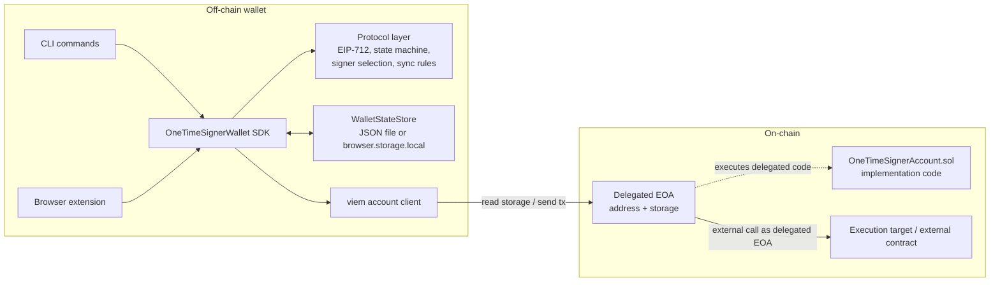
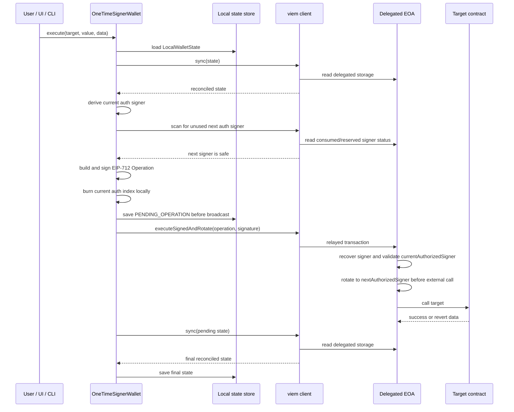

# Architecture

## Status

This project is an experimental research prototype for an EIP-7702 account controlled by rotating one-time ECDSA signer keys.

It is not audited, not production-ready, and must not be used with real assets.

For the threat model and security invariants, see [`02-threat-model.md`](./02-threat-model.md).

## High-level design

The system has two cooperating state machines:

* an on-chain delegated EOA account implemented by `src/OneTimeSignerAccount.sol`;
* an off-chain TypeScript wallet that derives signers, signs EIP-712 payloads, burns local key state, broadcasts through a relayer, and reconciles with on-chain storage.

The delegated account stores signer addresses and lifecycle state. The wallet owns private-key derivation and local key-consumption tracking.

The normal execution model is:

1. sync local state against delegated EOA storage;
2. derive the current one-time signer;
3. select a fresh next signer;
4. sign an EIP-712 operation;
5. burn the current signer locally and persist pending state;
6. submit the signed operation through a relayer;
7. rotate on-chain before external execution;
8. sync again from delegated EOA storage.



## EIP-7702 delegated EOA model

There are two distinct addresses:

| Address | Role |
| ------- | ---- |
| Delegated EOA | Account address users interact with. It owns account storage and ETH balance. |
| Implementation contract | Reusable `OneTimeSignerAccount.sol` code that the EOA delegates to. |

When the implementation executes through the delegated EOA:

* `address(this)` is the delegated EOA;
* storage reads and writes apply to delegated EOA storage;
* EIP-712 `verifyingContract` must be the delegated EOA;
* external calls are made from the delegated EOA address.

The implementation contract is reusable code. It must not be initialized or used directly as an account. `OneTimeSignerAccount.sol` includes a delegated-execution guard that reverts direct calls to state-changing account functions.

Implementation note: the contract cannot protect against compromise of the EIP-7702 authority key that controls delegation at the protocol level. If that key can replace or clear delegation, the contract-level one-time signer rules do not prevent that action.

See [`04-contract.md`](./04-contract.md) for contract-level details.

## Components

### Solidity Contract

```text
src/OneTimeSignerAccount.sol
```

The Solidity on-chain delegated account state machine: initialization, signer tracking, EIP-712 validation, rotation, pausing, and recovery.

See [`04-contract.md`](./04-contract.md) for contract-level details.

### TypeScript protocol layer

The protocol layer lives under:

```text
wallet/src/protocol/one-time-signer-account/
```

It contains the pure account-side wallet logic:

| Module               | Responsibility                                                                          |
| ----------------------| -----------------------------------------------------------------------------------------|
| `types.ts`           | Shared operation, recovery, EIP-712, and signed-message types.                          |
| `eip712.ts`          | Typed-data domain, message construction, hashing, signing, and signer recovery helpers. |
| `state.ts`           | Local wallet state machine and key-burning transitions.                                 |
| `signerSelection.ts` | Deterministic signer scanning with local and on-chain reuse checks.                     |
| `sync.ts`            | Pure reconciliation between local wallet state and on-chain account snapshots.          |

More details in: [`05-wallet-architecture.md`](./05-wallet-architecture.md)

### SDK

The main SDK class is:

```text
wallet/src/sdk/OneTimeSignerWallet.ts
```

More details in: [`05-wallet-architecture.md`](./05-wallet-architecture.md)

### Storage adapters

There are two current state-store adapters:

| Adapter                   | Location                                                 | Use                              |
| ---------------------------| ----------------------------------------------------------| ----------------------------------|
| `JsonWalletStateStore`    | `wallet/src/adapters/storage/JsonWalletStateStore.ts`    | CLI and local development.       |
| `BrowserWalletStateStore` | `wallet/src/adapters/storage/BrowserWalletStateStore.ts` | Browser extension state storage. |

More details in: [`05-wallet-architecture.md`](./05-wallet-architecture.md)

### viem client

The viem-backed client is:

```text
wallet/src/adapters/viem/OneTimeSignerAccountClient.ts
```

It handles RPC reads, signer status checks, signed-operation submission, signed-recovery submission, and receipt waiting.

### CLI

Local operational commands for initialization, sync, execution, failure scenarios, and recovery.       

More details in: [`06-cli.md`](./06-cli.md) 

### Browser extension

Experimental WXT/React browser-extension interface over the SDK.

```text
wallet/src/apps/extension/
wallet/entrypoints/
```

More details in: [`07-browser-wallet.md`](./07-browser-wallet.md)    

### Script

Local end-to-end scenario against a fresh Prague Anvil

```text
scripts/run-local-e2e.sh
```

More details in: [`../scripts/README.md`](../scripts/README.md)

## Normal operation lifecycle

A normal operation is an EIP-712 signed `Operation` containing:

* `target`;
* `value`;
* `data`;
* `nextAuthorizedSigner`;
* `deadline`.

The TypeScript typed-data message signs `dataHash = keccak256(data)`, matching the Solidity `operationStructHash()` logic.



The receipt is not the final source of truth. The final state is whatever `sync()` derives from delegated EOA storage.

This matters because `executeSignedAndRotate()` is designed to preserve signer rotation after valid authorization even when later execution returns failure data, such as an expired operation, zero target, invalid next signer, or target revert.

## Recovery lifecycle

Recovery is the path out of local `PAUSED` state.

At a high level:

1. sync local state with delegated account storage;
2. require local state to reconcile to `PAUSED`;
3. derive the current recovery signer;
4. confirm the recovery signer is active on-chain;
5. select a fresh next authorized signer and next recovery signer;
6. sign a `RecoveryOperation`;
7. burn the current recovery signer locally and persist `PENDING_RECOVERY`;
8. submit `signedRecovery()` through a relayer;
9. consume the recovery signer on-chain after valid recovery authorization;
10. sync from delegated EOA storage.

Recovery keys are one-time keys. A recovery signature consumes the recovery key even if the recovery operation is expired or cannot fully restore the account.

The sync logic distinguishes:

* pending recovery not mined yet;
* recovery failed but consumed the recovery signer;
* full recovery success;
* critical partial recovery where the authorized signer advanced but the next recovery signer was not active.

In the critical partial recovery case, the wallet raises a sync invariant error instead of guessing a safe local state.

## State and trust boundaries

### Local wallet state

`LocalWalletState` is part of the security model. It records current signer indices, signer addresses, burned auth/recovery indices, pending signatures, transaction hashes, and lifecycle status.

The wallet must persist state immediately after signing and before broadcasting. If local state and on-chain state cannot be reconciled safely, the wallet must refuse to sign.

### Browser storage

`browser.storage.local` is used by the extension state adapter for `LocalWalletState`.

This storage is convenient for the prototype but is not a hardened key-management boundary. The current browser wallet also stores development settings separately, including sensitive local-test configuration. See [`07-browser-wallet.md`](./07-browser-wallet.md).

### JSON state store

The JSON store is used by CLI and local scripts. It is suitable for local development and tests. It is not encrypted and is not intended to protect real wallet state.

Because it contains burned-key history and pending signatures, copying, reverting, or editing the file can break wallet safety assumptions.

### RPC provider

The RPC provider is used to read delegated account storage, check signer status, broadcast relayed transactions, and wait for receipts.

Receipts are inclusion signals, not final wallet state. The wallet performs `sync()` by reading delegated account storage and should fail closed when state cannot be reconciled.

### Delegated EOA storage

Delegated EOA storage is the on-chain source of truth for initialization, paused status, current authorized signer, consumed/reserved signers, and active recovery signers.

Under EIP-7702, this storage belongs to the EOA, not the implementation contract.

### Implementation contract

The implementation contract provides reusable code. It is not the account, must not be initialized directly, and is protected against direct state-changing account use.

Multiple delegated EOAs may point to the same implementation code while keeping independent storage.

### Relayer

The relayer submits transactions for signed operations and recovery operations. It can affect delivery but does not produce the authorization signature.

### Authority key

The EIP-7702 authority key controls delegation at the protocol level. This is outside the contract’s signer-rotation mechanism.

The prototype assumes a future mechanism such as EIP-7851 to disable that authority; until then, authority-key compromise remains out of scope.

## Experimental and dev-only areas

Reusable but still experimental core:

* `src/OneTimeSignerAccount.sol`;
* `wallet/src/protocol/one-time-signer-account/*`;
* `wallet/src/sdk/OneTimeSignerWallet.ts`;
* `wallet/src/sdk/ports.ts`;
* `wallet/src/adapters/viem/OneTimeSignerAccountClient.ts`;
* storage adapter interfaces and implementations.

Prototype product surfaces:

* CLI commands;
* browser extension UI and background integration;
* local wallet state import/configuration flows.

Dev-only and test flows:

* `test/mocks/ExecutionTarget.sol`;
* `script/DeployExecutionTarget.s.sol`;
* `scripts/run-local-e2e.sh`;
* `execute:target-revert`;
* `execute:expired-set-number`;
* `execute:invalid-next-auth`;
* `beginUnsafeOperationSigningForPauseTest()`.

The invalid-next-signer path intentionally bypasses normal wallet validation to test contract pause behavior. Normal wallet flows must not use that unsafe transition.

## Related documentation

* [`README.md`](../README.md): repository entry point.
* [`README.md`](./README.md): documentation index.
* [`00-quickstart.md`](./00-quickstart.md): local setup and first run.
* [`02-threat-model.md`](./02-threat-model.md): threat model and security assumptions.
* [`04-contract.md`](./04-contract.md): Solidity account behavior and contract-level invariants.
* [`05-wallet-architecture.md`](./05-wallet-architecture.md): TypeScript wallet internals and state machine.
* [`06-cli.md`](./06-cli.md): CLI commands and local workflows.
* [`07-browser-wallet.md`](./07-browser-wallet.md): browser extension architecture and limitations.
* [`08-testing.md`](./08-testing.md): Foundry, Vitest, and local E2E validation.