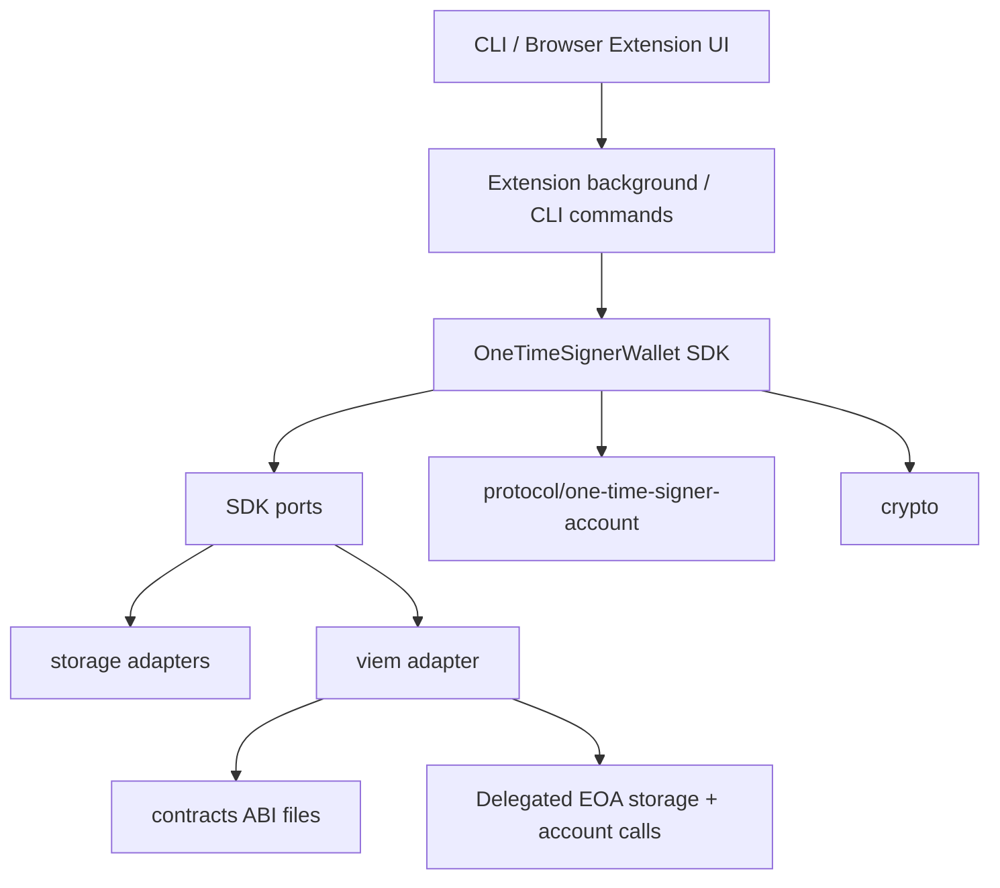
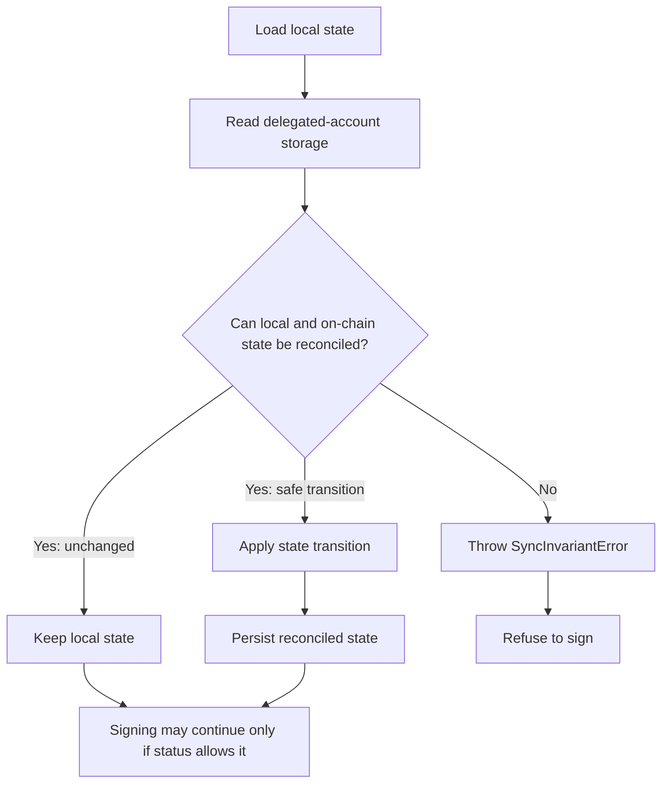

# Wallet Architecture

## Status

The TypeScript wallet is an experimental research prototype for `OneTimeSignerAccount`.

It is not production-ready. Do not use it with real assets, real mnemonics, or production relayer keys.

The current implementation is designed for local development and protocol experimentation. Several parts are intentionally minimal:

* local JSON state storage;
* browser-extension local storage;
* a WXT/React demo UI;
* CLI scripts for Anvil/local flows;
* dev-only adversarial scripts.

The wallet must be treated as safety-critical because it manages the off-chain side of the one-time signer invariant:

```text
Once a valid ECDSA signature is produced, the corresponding key must never be used again.
```

## Purpose

The TypeScript wallet is the off-chain state machine for the delegated EIP-7702 account.

It is responsible for:

1. deriving deterministic one-time ECDSA signers;
2. selecting a fresh next signer before signing;
3. constructing the exact EIP-712 payload expected by `OneTimeSignerAccount.sol`;
4. signing operations and recovery operations;
5. burning the signing key locally immediately after signing;
6. persisting the burned/pending state before broadcasting;
7. submitting signed payloads through a relayer;
8. reading delegated-account storage after a transaction;
9. reconciling local state with on-chain state;
10. refusing to sign if reconciliation is unsafe.

The wallet is not a general-purpose injected Ethereum wallet. It is a developer-oriented implementation for the one-time signer account experiment.

## Package layout

```text
wallet/
├── entrypoints/
│   ├── background.ts
│   ├── popup/
│   └── options/
├── src/
│   ├── adapters/
│   │   ├── storage/
│   │   └── viem/
│   ├── apps/
│   │   ├── cli/
│   │   └── extension/
│   ├── contracts/
│   ├── crypto/
│   ├── protocol/
│   │   └── one-time-signer-account/
│   └── sdk/
├── test/
├── package.json
├── tsconfig.json
├── tsconfig.extension.json
└── wxt.config.ts
```

The package separates pure protocol logic from environment-specific adapters.



## Core layers

### `protocol/one-time-signer-account`

Pure account protocol logic.

This layer contains:

* account operation types;
* EIP-712 domain and typed-data builders;
* low-level signing helpers;
* signer selection helpers;
* local wallet state transitions;
* local/on-chain reconciliation rules.

It does not perform RPC calls and does not know where state is stored.

### `sdk`

High-level wallet orchestration.

`OneTimeSignerWallet` is the main SDK boundary used by the CLI and browser extension. It centralizes the safety-critical sequence:

```text
sync -> derive -> select next signer -> sign -> burn locally -> persist -> broadcast -> wait -> sync
```

UI code should call the SDK instead of calling low-level signing helpers directly.

### `ports`

Interfaces required by the SDK.

The SDK depends on ports instead of concrete implementations:

* `WalletStateStore`

  * `load()`
  * `save(state)`
* `OneTimeSignerAccountClientPort`

  * synchronization;
  * signer status reads;
  * transaction submission;
  * receipt waiting.

This keeps the SDK independent from JSON files, browser storage, viem, mocks, or future adapters.

### `adapters/storage`

Persistence adapters for `LocalWalletState`.

Current adapters:

* `JsonWalletStateStore`
* `BrowserWalletStateStore`

Both implement the same storage port, but they target different environments.

### `adapters/viem`

RPC and transaction adapter for the delegated account.

It uses viem to:

* read delegated-account storage;
* check whether signers are consumed, reserved, or active recovery signers;
* submit `executeSignedAndRotate`;
* submit `signedRecovery`;
* wait for transaction receipts.

The relayer private key pays gas. It is not the one-time auth or recovery signer.

### `crypto`

Deterministic signer derivation and hex utilities.

This layer derives independent signer streams:

```text
auth[i]      normal operation signer
recovery[i]  recovery operation signer
```

The returned private keys should only be used by the signing flow and must be treated as burned after one valid signature.

### `contracts`

TypeScript ABI files for contracts used by the wallet:

* `OneTimeSignerAccount.abi.ts`
* `ExecutionTarget.abi.ts`

The wallet uses these ABIs through the viem adapter and local demo flows.

### `apps/cli`

Local development CLI flows.

The CLI uses the same SDK, protocol logic, viem adapter, and JSON state store as the rest of the package. It is mainly for initialization, local execution, sync, recovery, and adversarial tests.

### `apps/extension`

Browser extension prototype.

The extension UI sends messages to the WXT background script. The background script creates the SDK wallet and calls `sync()`, `execute()`, or `recover()`.

The popup does not directly derive private keys or call low-level signing helpers.

## Protocol layer

The protocol layer lives in:

```text
src/protocol/one-time-signer-account/
├── eip712.ts
├── signerSelection.ts
├── state.ts
├── sync.ts
└── types.ts
```

### `types.ts`

Defines the shared account-level data structures:

* `Operation`
* `OperationTypedMessage`
* `RecoveryOperation`
* `Eip712AccountContext`
* `SignedOperation`
* `SignedRecoveryOperation`

The code intentionally separates runtime calldata from the EIP-712 message. For normal operations, the contract signs `dataHash`, not raw calldata bytes.

### `eip712.ts`

Builds and signs the typed data expected by `OneTimeSignerAccount.sol`.

The EIP-712 domain is:

```text
name              OneTimeSignerAccount
version           1
chainId           state.chainId
verifyingContract state.delegatedAccount
```

Under EIP-7702, `verifyingContract` is the delegated EOA. It is not the implementation contract.

Normal operation typed data:

```text
Operation(
  address target,
  uint256 value,
  bytes32 dataHash,
  address nextAuthorizedSigner,
  uint256 deadline
)
```

The wallet computes:

```text
dataHash = keccak256(operation.data)
```

Recovery typed data:

```text
RecoveryOperation(
  address nextAuthorizedSigner,
  address nextRecoverySigner,
  uint256 deadline
)
```

The signing helpers are low-level primitives. They do not burn keys by themselves. Safety-critical flows must call them through the SDK and state machine.

### `signerSelection.ts`

Selects fresh signers from deterministic streams.

For normal operations, `findNextUnusedAuthSigner()` scans from `currentAuthIndex + 1` and skips:

* locally burned auth indices;
* signers marked consumed or reserved on-chain.

For recovery, `findNextAvailableRecoverySigner()` scans from `currentRecoveryIndex + 1` and skips:

* locally burned recovery indices;
* recovery signers already active on-chain;
* signers consumed or reserved on-chain.

The search is bounded by a lookahead window. The default used by the SDK is `50`.

### `state.ts`

Implements the local state machine.

The wallet status can be:

```text
READY
PENDING_OPERATION
PAUSED
PENDING_RECOVERY
```

`READY` means normal operation signing is allowed.

`PENDING_OPERATION` means an auth signature has already been produced and the consumed auth key is burned locally. The wallet must sync before deciding whether the operation advanced, is still pending, or led to pause.

`PAUSED` means normal signing is blocked. Recovery is the only supported way forward in this prototype.

`PENDING_RECOVERY` means a recovery signature has already been produced and the consumed recovery key is burned locally. The wallet must sync before deciding the recovery outcome.

The key transition is `beginOperationSigning()`:

1. assert the wallet is `READY`;
2. assert no operation or recovery is pending;
3. assert the current auth index is not already burned;
4. assert the signature was produced by `currentAuthorizedSigner`;
5. assert the next signer is non-zero and different;
6. mark the current auth index as burned;
7. create a `PENDING_OPERATION`.

The equivalent recovery transition is `beginRecoverySigning()`, which burns the current recovery signer and creates a `PENDING_RECOVERY`.

There is also a `beginUnsafeOperationSigningForPauseTest()` helper. It intentionally bypasses normal next-signer validation and exists only for dev-only pause-path testing.

### `sync.ts`

Implements pure reconciliation between local state and on-chain storage snapshots.

It does not perform RPC calls. The viem adapter builds an `OnchainAccountSnapshot`, and `sync.ts` decides whether the local state can move safely.

If the local and on-chain states cannot be reconciled, it throws `SyncInvariantError`. Callers must treat this as a hard stop for signing.

## SDK

The main SDK class is:

```text
src/sdk/OneTimeSignerWallet.ts
```

It exposes:

* `getState()`
* `sync()`
* `execute(params)`
* `recover(params)`

### Normal execution flow

`execute()` performs:

```text
1. sync local state with on-chain storage
2. require READY
3. derive current auth signer
4. assert derived signer matches local currentAuthorizedSigner
5. find next unused auth signer
6. build Operation
7. sign EIP-712 Operation
8. compute operation digest
9. burn current auth key locally by moving to PENDING_OPERATION
10. persist local state
11. broadcast executeSignedAndRotate through the client
12. attach txHash
13. persist local state again
14. wait for receipt
15. sync from on-chain storage
16. persist final reconciled state
```

The receipt is not the final source of truth. The final state comes from `sync()`.

### Recovery flow

`recover()` performs:

```text
1. sync local state with on-chain storage
2. require PAUSED
3. derive current recovery signer
4. assert derived signer matches local currentRecoverySigner
5. require current recovery signer to be active on-chain
6. find next unused auth signer
7. find next available recovery signer
8. build RecoveryOperation
9. sign EIP-712 RecoveryOperation
10. compute recovery digest
11. burn current recovery key locally by moving to PENDING_RECOVERY
12. persist local state
13. broadcast signedRecovery through the client
14. attach txHash
15. persist local state again
16. wait for receipt
17. sync from on-chain storage
18. persist final reconciled state
```

Recovery rotates both streams when it succeeds:

```text
currentAuthorizedSigner -> nextAuthorizedSigner
currentRecoverySigner   -> nextRecoverySigner
```

## Storage adapters

### `JsonWalletStateStore`

`JsonWalletStateStore` stores `LocalWalletState` in a JSON file.

It is used by the CLI and local scripts.

Behavior:

* `load()` returns `null` if the file does not exist;
* `save()` writes to a temporary file and then renames it into place;
* the JSON file records burned keys, pending signatures, signer indices, and account context.

The temporary-file write pattern helps avoid many partial-write failures during local development. It is not encrypted storage and is not production hardening.

### `BrowserWalletStateStore`

`BrowserWalletStateStore` stores `LocalWalletState` under:

```text
one-time-signer-wallet:state
```

in `browser.storage.local`.

It only stores the wallet state. Extension settings are stored separately by the extension config layer.

Browser storage must not be treated as secure storage. In the current prototype, the extension also stores development settings such as mnemonic, RPC URL, and relayer key in extension local storage. This is acceptable only for local development with test secrets.

## viem adapter

The viem adapter lives in:

```text
src/adapters/viem/OneTimeSignerAccountClient.ts
```

It implements the account client port required by the SDK.

Read methods:

* `readIsInitialized()`
* `readIsPaused()`
* `readCurrentAuthorizedSigner()`
* `readIsConsumedOrReservedSigner(signer)`
* `readIsActiveRecoverySigner(signer)`

Write methods:

* `executeSignedAndRotate({ operation, signature })`
* `signedRecovery({ recoveryOperation, signature })`

Synchronization:

* `readSnapshotForState(state)` reads the on-chain fields needed for the current local status;
* `sync(state)` builds a snapshot and delegates interpretation to `reconcileLocalState()`.

For `PENDING_RECOVERY`, the adapter also reads whether:

* the consumed recovery signer is still active;
* the next recovery signer is active.

Those extra reads are needed to distinguish:

* recovery transaction not landed yet;
* recovery key consumed but recovery failed;
* full recovery success;
* critical partial recovery.

## Local state model

`LocalWalletState` represents one delegated account.

Core fields:

```text
schemaVersion
chainId
delegatedAccount
implementationAddress
walletId
accountIndex

status

currentAuthIndex
currentAuthorizedSigner

currentRecoveryIndex
currentRecoverySigner

burnedAuthIndices
burnedRecoveryIndices

pendingOperation?
pendingRecovery?

updatedAtUnix
```

The burned index arrays are part of the security model. They are not UI history.

A pending operation records:

```text
consumedAuthIndex
consumedAuthSigner
nextAuthIndex
nextAuthorizedSigner
operationDigest
signature
signedAtUnix
txHash?
```

A pending recovery records:

```text
consumedRecoveryIndex
consumedRecoverySigner
nextAuthIndex
nextAuthorizedSigner
nextRecoveryIndex
nextRecoverySigner
recoveryDigest
signature
signedAtUnix
txHash?
```

The pending records preserve the information needed to reconcile against on-chain storage after broadcast.

## Signing and persistence rules

The most important wallet-side rule is:

```text
Local state must be persisted immediately after signing and before broadcast.
```

This applies to both normal operations and recovery operations.

Reason:

```text
signature observed == signer exposed
```

in the project threat model.

Therefore, once the SDK receives a valid signature from the current auth or recovery signer, the corresponding index must be locally burned even if:

* broadcasting fails;
* the transaction is dropped;
* the target call reverts;
* the operation expires;
* the relayer errors;
* the browser or CLI process crashes after signing.

The implementation enforces this by moving to a pending state and calling `store.save(state)` before submitting the transaction.

After broadcast, the SDK attaches the transaction hash and persists again. This second save is useful for tracking the pending transaction, but the first save is the safety-critical one.

## Synchronization and reconciliation

`sync()` reads delegated-account storage and reconciles it against local state.

The final source of truth after a transaction is not the receipt. It is on-chain account storage interpreted by the reconciliation rules.



### Reconciliation outcomes

For `READY`:

* if on-chain signer matches local signer, state remains `READY`;
* if on-chain account is paused, local state moves to `PAUSED`;
* if the signer differs, sync fails.

For `PENDING_OPERATION`:

* if on-chain signer is still the consumed signer, the operation remains pending;
* if on-chain signer is the expected next signer, local state moves to `READY`;
* if on-chain account is paused, local state moves to `PAUSED`;
* any other signer is an unsafe desync.

For `PAUSED`:

* if on-chain account is paused, state remains `PAUSED`;
* if on-chain account is unpaused unexpectedly, sync fails.

For `PENDING_RECOVERY`:

* if the account is still paused and the consumed recovery signer is still active, recovery remains pending;
* if the account is still paused and the consumed recovery signer is no longer active, recovery failed but the recovery key was consumed, so local state returns to `PAUSED`;
* if the account is unpaused, the auth signer advanced, and the next recovery signer is active, recovery succeeded and local state moves to `READY`;
* if the account is unpaused and the auth signer advanced but the next recovery signer is not active, sync fails with a critical partial recovery error.

The reconciliation rule is strict:

```text
If local state and on-chain state cannot be safely reconciled, the wallet must refuse to sign.
```

## CLI and browser extension integration

The CLI and browser extension reuse the same SDK and protocol state machine. Their role is to provide operational surfaces, not separate protocol implementations.

| Surface | Storage | Ethereum adapter | Scope | Detail |
| ------- | ------- | ---------------- | ----- | ------ |
| CLI | `JsonWalletStateStore` | `OneTimeSignerAccountClient` | Local initialization, sync, execution, failure scenarios, and recovery. | [`06-cli.md`](./06-cli.md) |
| Browser extension | `BrowserWalletStateStore` plus extension settings storage | `OneTimeSignerAccountClient` | Experimental WXT/React UI for sync, demo execution, recovery, and state import/export. | [`07-browser-wallet.md`](./07-browser-wallet.md) |

Both surfaces should call `OneTimeSignerWallet` for safety-critical flows. They should not call low-level signing helpers directly unless the flow is explicitly dev-only and documented as unsafe.

## Security-sensitive areas

### EIP-712 verifying contract

The EIP-712 `verifyingContract` must be the delegated EOA address.

Do not use the implementation contract address as the verifying contract.

### Local burned-key state

`burnedAuthIndices` and `burnedRecoveryIndices` prevent accidental key reuse after signing.

Losing or corrupting local state can make the wallet unsafe. If the wallet cannot reconcile local and on-chain state, it must stop signing.

### Sign-before-broadcast boundary

The key is considered consumed when the signature is produced, not when a transaction is mined.

The SDK must persist the pending state before broadcast.

### Recovery signer handling

Recovery signers are also one-time keys.

A failed recovery may still consume the recovery signer. The wallet models this by returning from `PENDING_RECOVERY` to `PAUSED` while keeping the recovery index burned.

### Browser storage

The current extension stores prototype data in `browser.storage.local`.

Do not claim or assume this is secure. Production hardening would require a dedicated secret-storage and unlock design, stricter message validation, user confirmations, and a full extension privilege-boundary review.

### Low-level signing helpers

`signOperation()` and `signRecoveryOperation()` do not update local state.

They are useful for tests and dev scripts, but production-like flows must go through `OneTimeSignerWallet`.

### Dev-only unsafe transition

`beginUnsafeOperationSigningForPauseTest()` exists only to test the contract pause path for invalid `nextAuthorizedSigner`.

Normal wallet flows must never use it.

## Test coverage

Wallet logic is covered by Vitest tests under:

```text
test/crypto/
test/protocol/
test/sdk/
```

The suite covers deterministic signer derivation, EIP-712 construction, local state transitions, sync reconciliation, refusal on unsafe desync, and SDK execution/recovery orchestration.

See [`08-testing.md`](./08-testing.md) for the testing checklist, command matrix, and known gaps.

## Known limitations

* The wallet is experimental and not production-ready.
* The browser extension stores development secrets in local extension storage.
* There is no production unlock lifecycle or encrypted secret store.
* There is no generic injected provider interface.
* The extension currently exposes a narrow demo flow around `ExecutionTarget.setNumber`.
* Multi-device active signing is out of scope. Two devices sharing the same mnemonic and wallet ID could attempt to use the same current auth key.
* The signer lookahead window is bounded. If local state is wrong or many signers are skipped, signer selection can fail.
* Low-level signing helpers can be misused if called without the state machine.
* Recovery is intentionally restricted to locally/on-chain reconciled `PAUSED` state.
* The package script for `sign:demo` should be checked: `package.json` references `sign-Demo.ts`, while the repository tree contains `signDemo.ts`.


## Where to go next

* [`../README.md`](../README.md): repository entry point and basic commands.
* [`README.md`](./README.md): documentation index.
* [`00-quickstart.md`](./00-quickstart.md): local setup and first run.
* [`01-overview.md`](01-overview.md): conceptual entry point. 
* [`02-threat-model.md`](./02-threat-model.md): threat model, assumptions, and security invariants.
* [`03-architecture.md`](./03-architecture.md): system architecture and trust boundaries.
* [`04-contract.md`](./04-contract.md): Solidity account behavior.
* :pushpin: **[`05-wallet-architecture.md`](./05-wallet-architecture.md): TypeScript wallet internals.**
* [`06-cli.md`](./06-cli.md): CLI commands and local workflows.
* [`07-browser-wallet.md`](./07-browser-wallet.md): browser extension prototype.
* [`08-testing.md`](./08-testing.md): Foundry, Vitest, and local E2E validation.