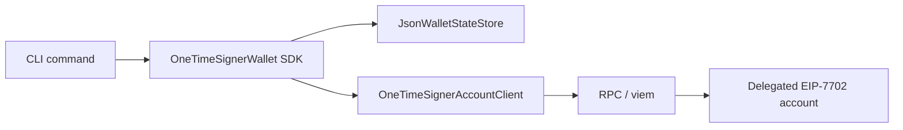

# CLI

## Status

The CLI is experimental development tooling for the One-Time Signer Wallet prototype.

It is intended for:

* local demos;
* protocol validation;
* testing wallet state transitions;
* exercising failure and recovery paths.

## Purpose

The CLI provides a thin operational layer over the wallet SDK. It lets the main account flows be exercised from the terminal without using the browser extension UI.

The CLI also makes it easier to inspect how local wallet state changes across:

* initialization;
* synchronization;
* normal execution;
* failed target execution;
* expired operations;
* invalid signer rotation;
* paused-account recovery.

## Requirements

Run CLI commands from `wallet/`:

```bash
cd wallet
```

Install dependencies first:

```bash
pnpm install
```

The CLI assumes a local or development chain is available and that the account contracts have been deployed and initialized using the repository’s Foundry scripts.

The CLI does not replace the root-level local demo flow. For the end-to-end setup, use the project quickstart or:

```bash
./scripts/run-local-e2e.sh
```

## Initialization flow

### 1. Prepare initialization data

```bash
pnpm prepare:init
```

This command derives the first auth and recovery signers for the delegated EOA.

It writes:

* `.local/init.json`, consumed by the wallet CLI;
* `.local/init.env`, intended for the Foundry initialization scripts.

The generated values include:

* delegated account address;
* implementation address;
* `auth[0]`;
* `recovery[0]`;
* chain ID;
* account index.

The delegated account is the EOA derived from `AUTHORITY_PRIVATE_KEY`.

### 2. Initialize the delegated account on-chain

Use the generated initialization values with the repository’s Foundry scripts.

This document does not duplicate the full deployment flow. The important requirement is that on-chain delegated-account storage must be initialized with the same first auth and recovery signers generated by `pnpm prepare:init`.

### 3. Create local wallet state

```bash
pnpm state:init
```

This command reads `.local/init.json`, derives the expected `auth[0]` and `recovery[0]` again, and refuses to continue if local derivation does not match the initialization file.

It then reads delegated-account storage through `sync()` and only writes `.local/state.json` if the on-chain account matches the expected initial `READY` state.

### 4. Sync after initialization

```bash
pnpm sync
```

This verifies that the persisted local state and delegated-account storage can still be reconciled.

## Normal operation

### Execute `setNumber`

```bash
pnpm execute:set-number
```

This command executes `ExecutionTarget.setNumber(uint256)` through the delegated account.

Default behavior:

* target: `EXECUTION_TARGET_ADDRESS`;
* number: `NEW_NUMBER`, default `42`;
* value: `OPERATION_VALUE_ETH`, default `0`;
* deadline: `DEADLINE_SECONDS`, default `3600`.

Internally, the SDK follows the security-critical sequence:

```text
sync -> derive current signer -> find next unused signer -> sign
-> burn current signer locally -> persist state -> broadcast
-> wait for receipt -> sync from on-chain storage -> persist reconciled state
```

The command requires `RELAYER_PRIVATE_KEY` because the relayer submits the transaction. The relayer is not the auth signer.

## Sync

```bash
pnpm sync
```

`sync` reconciles the local JSON state with delegated-account storage.

It does not:

* derive signers;
* produce signatures;
* send transactions.

It reads the local state file, queries the delegated account, applies the reconciliation rules, and saves the updated state if needed.

Use it whenever local state may be stale, especially after interrupted commands or manual contract interaction.

The receipt is not treated as the source of truth. The source of truth is delegated-account storage read during sync.

## Recovery

```bash
pnpm recover
```

Recovery is only valid when the local state reconciles to `PAUSED`.

The command:

* syncs first;
* verifies that the wallet is paused;
* derives the current recovery signer;
* checks that the current recovery signer is active on-chain;
* finds a fresh auth signer;
* finds a fresh recovery signer;
* signs a `RecoveryOperation`;
* burns the current recovery signer locally before broadcast;
* submits `signedRecovery`;
* syncs from on-chain storage after inclusion.

A successful recovery restores the account to `READY` with:

* a fresh current authorized signer;
* a fresh current recovery signer.

Recovery keys are one-time keys too.

## Failure and dev-only flows

These commands intentionally exercise edge cases. They are useful for validating security invariants, not for normal wallet usage.

### Target revert

```bash
pnpm execute:target-revert
```

Calls `ExecutionTarget.alwaysRevert()` through the account.

This demonstrates that a target-level revert does not globally revert the account operation. The signer rotation must survive even if the external call fails.

Expected behavior:

* transaction receipt status is `success`;
* sync reason is `PENDING_OPERATION_TO_READY`;
* wallet returns to `READY`;
* auth index advances.

### Expired operation

```bash
pnpm execute:expired-set-number
```

Creates a `setNumber` operation with an already-expired deadline.

This validates that failure after observing a valid signature does not revive the consumed signer.

Expected behavior:

* transaction receipt status is `success`;
* sync reason is `PENDING_OPERATION_TO_READY`;
* wallet returns to `READY`;
* auth index advances.

Default `NEW_NUMBER` for this command is `777`.

### Invalid next authorized signer

```bash
pnpm execute:invalid-next-auth
```

Dev-only adversarial flow.

This command intentionally signs an operation with an invalid `nextAuthorizedSigner` value: the zero address.

A production wallet must never sign this payload.

The script bypasses the normal safe state transition and uses an explicit unsafe dev-only transition to test the emergency pause path.

Expected behavior:

* transaction does not globally revert;
* account enters `PAUSED`;
* consumed auth key remains burned locally;
* normal execution is blocked until recovery;
* sync reason is `PENDING_OPERATION_TO_PAUSED`.

Default `NEW_NUMBER` for this command is `999`.

## Dev/demo commands

### Derivation demo

```bash
pnpm derive:demo
```

Prints deterministic auth and recovery signer addresses from a hardcoded test mnemonic.

This command does not read wallet state, connect to RPC, sign transactions, or use real secrets.

### Signing demo

```bash
pnpm sign:demo
```

Derives deterministic test signers, signs sample `Operation` and `RecoveryOperation` payloads, prints the EIP-712 digests and signatures, and recovers the signer addresses.

This command is only a local signing demonstration. It does not read wallet state or send transactions.

Implementation note: `package.json` maps this command to `src/apps/cli/commands/dev/sign-Demo.ts`. If the command fails on a case-sensitive filesystem, check that the package script path matches the actual filename.

### Package-level development scripts

The wallet package also exposes development scripts that are not account CLI flows:

```bash
pnpm test
pnpm test:watch
pnpm typecheck
pnpm typecheck:extension
pnpm typecheck:all
pnpm extension:dev
pnpm extension:build
pnpm extension:zip
```

Use these for tests, TypeScript checks, and browser extension development.

## How the CLI fits into the wallet architecture

The CLI is a thin wrapper around the wallet SDK:



The SDK owns the critical signing sequence. CLI commands should not call low-level signing helpers directly unless they are explicitly dev-only adversarial tests.

For the wallet internals behind this flow, see [`05-wallet-architecture.md`](./05-wallet-architecture.md).

## Where to go next

* [`../README.md`](../README.md): repository entry point and basic commands.
* [`README.md`](./README.md): documentation index.
* [`00-quickstart.md`](./00-quickstart.md): local setup and first run.
* [`01-overview.md`](01-overview.md): conceptual entry point. 
* [`02-threat-model.md`](./02-threat-model.md): threat model, assumptions, and security invariants.
* [`03-architecture.md`](./03-architecture.md): system architecture and trust boundaries.
* [`04-contract.md`](./04-contract.md): Solidity account behavior.
* [`05-wallet-architecture.md`](./05-wallet-architecture.md): TypeScript wallet internals, including key derivation.
* :pushpin: **[`06-cli.md`](./06-cli.md): CLI commands and local workflows.**
* [`07-browser-wallet.md`](./07-browser-wallet.md): browser extension prototype.
* [`08-testing.md`](./08-testing.md): Foundry, Vitest, and local E2E validation.