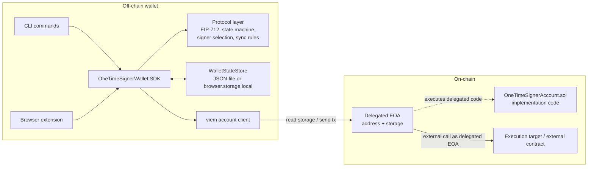
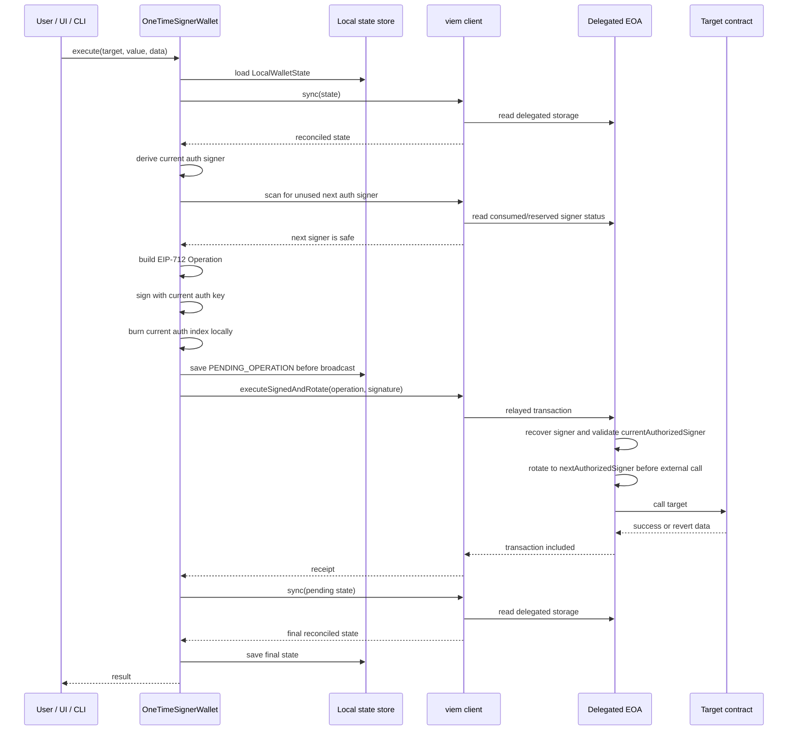

# Architecture

## Status

This project is an experimental research prototype for an EIP-7702 account controlled by rotating one-time ECDSA signer keys.

It is not audited, not production-ready, and must not be used with real assets.

The architecture is designed around one security rule:

> Once a valid ECDSA signature from an authorized key has been produced or observed, that key must never control the account again.

The system combines:

* a Solidity account implementation intended to run as EIP-7702 delegated code;
* a TypeScript protocol layer that mirrors the account’s signing and state rules;
* a wallet SDK that enforces the critical signing sequence;
* storage adapters for local wallet state;
* a viem client for on-chain reads and relayed writes;
* CLI and browser-extension entrypoints for local experimentation.

## High-level design

The account is a delegated EOA that behaves like a minimal smart account. The Solidity implementation stores only signer addresses and account state. The actual ECDSA private keys are derived and managed off-chain by the wallet.

The wallet maintains local state for:

* the current authorization signer index;
* the current recovery signer index;
* locally burned authorization and recovery indices;
* pending signed operations;
* pending signed recovery operations;
* the last synchronized account status.

The contract maintains delegated-account storage for:

* initialization status;
* paused status;
* the current authorized signer;
* consumed or reserved signer addresses;
* active recovery signer addresses.

The core execution model is:

1. The wallet syncs local state against delegated EOA storage.
2. The wallet derives the current one-time signer.
3. The wallet selects a fresh next signer.
4. The wallet signs an EIP-712 operation.
5. The wallet immediately burns the current signer locally and persists the pending state.
6. A relayer submits the signed operation.
7. The contract verifies the signature and rotates before executing the target call.
8. The wallet syncs again from on-chain storage and reconciles local state.



## EIP-7702 delegated EOA model

The contract is written to run as delegated code under EIP-7702.

There are two distinct addresses:

| Address                 | Role                                                                                  |
| -------------------------| ---------------------------------------------------------------------------------------|
| Delegated EOA           | The account address users interact with. It owns the account storage and ETH balance. |
| Implementation contract | The deployed `OneTimeSignerAccount.sol` code that the EOA delegates to.               |

When the implementation executes through the delegated EOA:

* `address(this)` is the delegated EOA;
* storage reads and writes apply to the delegated EOA;
* EIP-712 `verifyingContract` must be the delegated EOA;
* external calls are made from the delegated EOA address.

This distinction is critical. The implementation contract is reusable code. It must not be initialized or used directly as an account.

`OneTimeSignerAccount.sol` includes a delegated-execution guard using an immutable implementation address. If `address(this)` equals the implementation address, account functions revert with `MustBeCalledThroughDelegation`.

Initialization is also tied to the delegated account context. `initialize()` must be called through the delegated EOA and requires `msg.sender == address(this)`, which matches the intended setup flow where delegation is attached and the account initializes itself during the EIP-7702 setup transaction.

Implementation note: the contract cannot protect against compromise of the EIP-7702 authority key that controls delegation at the protocol level. If that key can replace or clear delegation, the contract-level one-time signer rules do not prevent that action.

## Components

### `src/OneTimeSignerAccount.sol`

The Solidity account implementation defines the on-chain state machine.

Its main responsibilities are:

* initialize delegated account storage;
* track the current authorized signer;
* track consumed or reserved signer addresses;
* track active recovery signers;
* verify EIP-712 operation signatures;
* rotate the authorized signer before external calls;
* pause the account if rotation cannot safely continue;
* consume recovery signers after valid recovery signatures;
* restore the account through recovery.

The contract stores signer addresses, not raw keys. Each signer address is expected to correspond to a fresh one-time ECDSA keypair managed off-chain.

Normal signed execution goes through `executeSignedAndRotate()`. Recovery through EIP-712 signatures goes through `signedRecovery()`.

The contract also exposes direct rotation functions:

* `rotateAuthorizedSigner()`;
* `rotateAuthorizedSignerThroughRecovery()`.

The current wallet SDK flow uses signed operations and signed recovery, not direct signer-paid rotation.

### TypeScript protocol layer

The protocol layer lives under:

```text
wallet/src/protocol/one-time-signer-account/
```

It contains the pure account-side wallet logic:

| Module               | Responsibility                                                                          |
| -------------------- | --------------------------------------------------------------------------------------- |
| `types.ts`           | Shared operation, recovery, EIP-712, and signed-message types.                          |
| `eip712.ts`          | Typed-data domain, message construction, hashing, signing, and signer recovery helpers. |
| `state.ts`           | Local wallet state machine and key-burning transitions.                                 |
| `signerSelection.ts` | Deterministic signer scanning with local and on-chain reuse checks.                     |
| `sync.ts`            | Pure reconciliation between local wallet state and on-chain account snapshots.          |

The protocol layer deliberately does not perform RPC calls. It defines the rules that other adapters must follow.

### SDK

The main SDK class is:

```text
wallet/src/sdk/OneTimeSignerWallet.ts
```

This is the primary boundary for wallet UIs and scripts.

It centralizes the security-critical sequence:

```text
sync -> derive -> sign -> burn locally -> persist -> broadcast -> sync
```

UI code should call the SDK instead of directly using low-level signing helpers. The low-level EIP-712 helpers can produce signatures, but they do not update local burned-key state by themselves.

The SDK depends on ports defined in:

```text
wallet/src/sdk/ports.ts
```

These ports keep the SDK independent from a specific storage backend or Ethereum client.

### Storage adapters

There are two current state-store adapters:

| Adapter                   | Location                                                 | Use                              |
| ------------------------- | -------------------------------------------------------- | -------------------------------- |
| `JsonWalletStateStore`    | `wallet/src/adapters/storage/JsonWalletStateStore.ts`    | CLI and local development.       |
| `BrowserWalletStateStore` | `wallet/src/adapters/storage/BrowserWalletStateStore.ts` | Browser extension state storage. |

`JsonWalletStateStore` persists local state as JSON and writes through a temporary file followed by rename. This helps avoid partial writes during local development, but it is not encrypted or production-grade secure storage.

`BrowserWalletStateStore` stores only `LocalWalletState` in `browser.storage.local`. Extension settings such as mnemonic, RPC URL, passphrase, relayer private key, and execution target address are handled separately by extension configuration code.

The local state is security-sensitive. It records burned keys and pending signatures. Losing or rolling back this state can cause the wallet to attempt unsafe signing.

### viem client

The viem-backed client is:

```text
wallet/src/adapters/viem/OneTimeSignerAccountClient.ts
```

It provides:

* read access to delegated account storage;
* signer reservation checks;
* recovery signer checks;
* sync snapshots;
* relayed transaction submission for signed operations;
* receipt waiting.

The client separates authorization from gas payment:

* auth and recovery keys sign EIP-712 messages off-chain;
* the relayer account submits Ethereum transactions;
* the relayer is not the account authority and is not the authorized signer.

The current implementation uses an optional `relayerPrivateKey` locally. There is no separate remote relayer service in the attached implementation.

### CLI

The CLI commands are local developer entrypoints around the SDK.

Main flows include:

```text
pnpm prepare:init
pnpm state:init
pnpm sync
pnpm execute:set-number
pnpm execute:target-revert
pnpm execute:expired-set-number
pnpm execute:invalid-next-auth
pnpm recover
```

The CLI is used by the local end-to-end script:

```text
./scripts/run-local-e2e.sh
```

That script starts a Prague Anvil chain, deploys the implementation, attaches EIP-7702 delegation, initializes the delegated account, creates local wallet state, executes normal and adversarial flows, tests paused behavior, and verifies recovery.

### Browser extension

The browser extension is a prototype UI and background integration around the SDK.

The current background wallet integration:

* loads extension settings;
* loads imported local wallet state;
* creates a `BrowserWalletStateStore`;
* creates a viem-backed account client;
* creates `OneTimeSignerWallet`;
* exposes actions such as sync, demo `setNumber`, and recovery.

Implementation note: the current extension flow is not a general wallet provider or production dapp connector. It is an experimental interface for the prototype SDK and local account flows.

## Normal operation lifecycle

A normal operation is an EIP-712 signed `Operation` containing:

* `target`;
* `value`;
* `data`;
* `nextAuthorizedSigner`;
* `deadline`.

The TypeScript typed-data message signs `dataHash = keccak256(data)`, matching the Solidity `operationStructHash()` logic.



The receipt is not treated as the final source of truth. The final state is whatever `sync()` derives from delegated EOA storage.

This distinction matters because `executeSignedAndRotate()` is designed not to revert after a valid authorization has been observed for failures such as:

* invalid executable operation data;
* expired operation;
* target revert;
* pause caused by invalid next signer.

Those outcomes may still produce an included Ethereum transaction. The wallet must re-read storage and reconcile.

## Recovery lifecycle

Recovery is the path out of `PAUSED`.

At a high level:

1. The wallet syncs local state with delegated account storage.
2. Recovery is allowed only when the reconciled local status is `PAUSED`.
3. The wallet derives the current recovery signer.
4. The wallet checks that the recovery signer is still active on-chain.
5. The wallet selects:

   * a fresh next authorized signer;
   * a fresh next recovery signer.
6. The wallet signs a `RecoveryOperation`.
7. The wallet immediately burns the current recovery index locally.
8. The wallet persists `PENDING_RECOVERY` before broadcast.
9. A relayer submits `signedRecovery()`.
10. The contract consumes the recovery signer as soon as a valid recovery signature is accepted.
11. If recovery succeeds, the account installs a fresh authorized signer, registers a fresh recovery signer, and unpauses.
12. The wallet syncs from on-chain storage.

Recovery keys are also one-time keys. A recovery signature consumes the recovery key even if the recovery operation is expired or cannot fully restore the account.

The sync logic explicitly distinguishes:

* pending recovery not mined yet;
* recovery failed but consumed the recovery signer;
* full recovery success;
* critical partial recovery where the authorized signer advanced but the next recovery signer was not active.

In the critical partial recovery case, the wallet raises a sync invariant error instead of guessing a safe local state.

## State and trust boundaries

### Local wallet state

`LocalWalletState` is part of the security model.

It records:

* current signer indices;
* current signer addresses;
* burned auth indices;
* burned recovery indices;
* pending operation signatures;
* pending recovery signatures;
* account lifecycle status.

The wallet must persist state immediately after signing and before broadcasting. Once a signature exists, the corresponding key is considered burned locally regardless of transaction outcome.

If local state and on-chain state cannot be reconciled safely, the wallet must refuse to sign.

### Browser storage

`browser.storage.local` is used by the extension state adapter for `LocalWalletState`.

This storage is convenient for the prototype but should not be treated as a hardened key-management boundary. The attached adapter intentionally stores only wallet state and does not include extension settings such as mnemonic or relayer key.

Implementation note: production storage would need a stronger design for secret handling, rollback resistance, backup, recovery, and corruption handling.

### JSON state store

The JSON store is used by CLI and local scripts.

It is suitable for local development and tests. It is not encrypted and is not intended to protect real wallet state.

Because it contains burned-key history and pending signatures, copying, reverting, or editing the file can break wallet safety assumptions.

### RPC provider

The RPC provider is used for:

* reading delegated account storage;
* checking signer reservation status;
* broadcasting relayed transactions;
* waiting for receipts.

The wallet does not treat the provider’s transaction receipt as authoritative for account state. It uses receipts only as an inclusion signal, then performs `sync()` by reading delegated account storage.

A faulty or inconsistent RPC provider can still affect availability or cause sync failures. The wallet should fail closed when state cannot be reconciled.

### Delegated EOA storage

Delegated EOA storage is the on-chain source of truth for:

* `isInitialized`;
* `isPaused`;
* `currentAuthorizedSigner`;
* `isConsumedOrReservedSigner`;
* `isActiveRecoverySigner`.

Under EIP-7702, this storage belongs to the EOA, not the implementation contract.

The wallet reconciles local pending states against this storage. It does not infer final safety from events or receipts alone.

### Implementation contract

The implementation contract provides reusable code.

It is not the account. It should not be initialized directly, and the contract includes a guard against direct implementation use.

Multiple delegated EOAs may point to the same implementation code while keeping independent storage.

### Relayer

The relayer submits transactions for signed operations and recovery operations.

The relayer can affect transaction delivery but does not produce the authorization signature. It should not be able to control the account unless it also has a valid current auth or recovery signature.

### Authority key

The EIP-7702 authority key controls delegation at the protocol level.

This is outside the contract’s signer-rotation mechanism. The account contract can rotate its internal authorized signer, but it cannot prevent the authority key from changing the EIP-7702 delegation if that key is compromised.

## Experimental and dev-only areas

### Reusable prototype core

These parts are written as the reusable core of the prototype:

* `src/OneTimeSignerAccount.sol`;
* `wallet/src/protocol/one-time-signer-account/*`;
* `wallet/src/sdk/OneTimeSignerWallet.ts`;
* `wallet/src/sdk/ports.ts`;
* `wallet/src/adapters/viem/OneTimeSignerAccountClient.ts`;
* storage adapter interfaces and implementations.

They are still experimental and unaudited.

### Experimental product surfaces

These parts expose the prototype to users or developers:

* CLI commands;
* browser extension UI and background integration;
* local wallet state import/configuration flows.

They are useful for exercising the architecture, but they are not production wallet surfaces.

### Dev-only and test flows

These parts are intended for local validation and adversarial testing:

* `test/mocks/ExecutionTarget.sol`;
* `script/DeployExecutionTarget.s.sol`;
* `scripts/run-local-e2e.sh`;
* `execute:target-revert`;
* `execute:expired-set-number`;
* `execute:invalid-next-auth`;
* `beginUnsafeOperationSigningForPauseTest()`.

The invalid-next-signer path intentionally bypasses normal wallet validation to test the contract pause behavior. Production wallet flows must not use that unsafe transition.

## Related documentation

* [`README.md`](../README.md): project overview and entry points.
* [`docs/README.md`](./README.md): documentation index.
* [`docs/quickstart.md`](./quickstart.md): local setup and first run.
* [`docs/contract.md`](./contract.md): Solidity account behavior and contract-level invariants.
* [`docs/wallet-architecture.md`](./wallet-architecture.md): TypeScript wallet internals and state machine.
* [`docs/browser-wallet.md`](./browser-wallet.md): browser extension architecture and current limitations.
* [`docs/threat-model.md`](./threat-model.md): CRQC-oriented threat model and security assumptions.
* [`docs/testing.md`](./testing.md): Foundry, Vitest, and local E2E validation.
* [`docs/cli.md`](./cli.md): CLI commands and local workflows.
